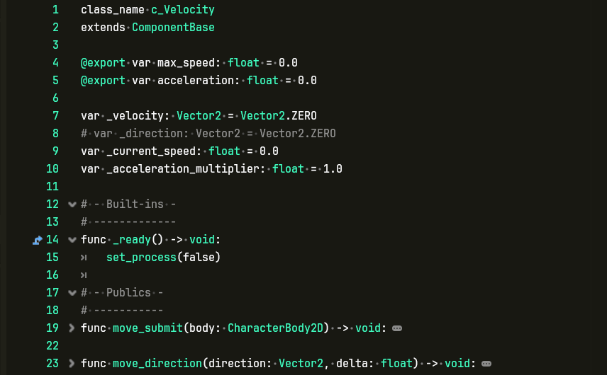
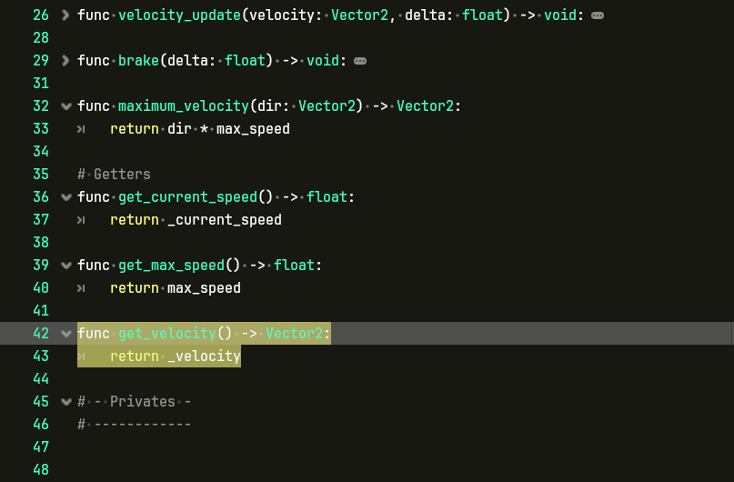

# godot-zp-themes

ZealousProgramming's personal collection of Godot script editor themes

## Installation

- Clone the repo:
  - HTTP: `git clone https://github.com/ZealousProgramming/godot-vim.git`
  - SSH: `git clone git@github.com:ZealousProgramming/godot-zp-themes.git`
- Copy the desired `*.tet` files to:
  - Windows: `%USERPROFILE%/AppData\Roaming\Godot\text_editor_themes`
- In Godot, navigate to the script editor -> File -> Themes -> Import Theme and select your desired theme

## Themes

- ghoul

## Screenshots

### ghoul

